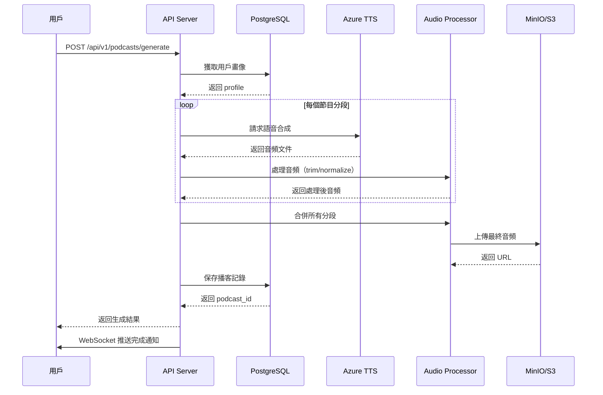

# Net 仔 - AI 粵語理財播客完整系統架構

## 📋 目錄

1. [系統概覽](#系統概覽)
2. [技術棧詳解](#技術棧詳解)
3. [核心功能模塊](#核心功能模塊)
4. [數據流程](#數據流程)
5. [部署架構](#部署架構)
6. [API 參考](#api-參考)

---

## 系統概覽

### 品牌定位
**Net 仔**係一個結合人工智能、音頻內容與心理學設計的垂直領域財經資訊平台，專注服務以粵語為母語的香港投資者。

### 解決五大痛點
- ❌ **資訊過載** → AI 個人化篩選
- ❌ **語言隔閡** → 100% 粵語內容
- ❌ **情緒孤立** → 互動電台 + 社群
- ❌ **決策困難** → 三維畫像 + 智能建議
- ❌ **時間碎片** → 原子化內容 + 語音導航

---

## 技術棧詳解

### 前端技術

| 層級 | 技術 | 用途 |
|------|------|------|
| Web App | React + Vite + TypeScript | 主應用界面 |
| Mobile | React Native (未來) | iOS/Android App |
| UI Components | Shadcn/ui + Tailwind CSS | 組件庫 |
| State Management | React Context + Hooks | 狀態管理 |
| Audio Player | HTML5 Audio API | 音頻播放 |
| Real-time | WebSocket | 實時推送 |

### 後端技術

| 服務 | 技術 | 原因 |
|------|------|------|
| Web Framework | FastAPI | 快速開發，異步支持，AI 生態豐富 |
| Database | PostgreSQL 15 | 可靠、成熟、免費、支持 JSON |
| Cache | Redis 7 | 高速緩存、Pub/Sub、消息隊列 |
| Object Storage | MinIO / AWS S3 | 音頻文件存儲 |
| TTS | Azure Cognitive Services | 高質素粵語語音 |
| AI/LLM | OpenAI GPT-4 | 內容生成、情感分析 |
| Task Queue | Celery + Redis | 背景任務（播客生成） |
| Monitoring | Prometheus + Grafana | 指標監控、可視化 |
| Logging | ELK Stack | 全文搜索、日誌分析 |

### 基礎設施

```yaml
容器化: Docker + Docker Compose
編排：Kubernetes (生產環境)
CI/CD: GitHub Actions
反向代理：Nginx / Traefik
SSL: Let's Encrypt
```

---

## 核心功能模塊

### 1. 用戶三維標籤系統

```python
class UserProfile:
    foundation: Literal["beginner", "intermediate", "advanced"]
    # 理財基礎：新手/中階/高階
    
    mindset: Literal["conservative", "balanced", "aggressive"]
    # 人生心態：求穩型/平衡型/進取型
    
    timeframe: Literal["long", "medium", "short"]
    # 時間視角：長線/中線/短線
```

**測試問題示例：**
- 理財基礎 → 「你對投資分析有幾熟悉？」
- 人生心態 → 「面對市場波動，你通常點反應？」
- 時間視角 → 「你期望持有一隻股票幾耐？」

### 2. TTS 語音生成服務

**Azure TTS 配置：**
```python
voice = "zh-HK-HiuMaanNeural"  # 曉曼（女聲）
region = "southeastasia"       # 新加坡（最近香港）
format = "Audio24Khz160KBitRateMonoMp3"
```

**情感支持：**
- 😊 Cheerful - 歡快（升市新聞）
- 💼 Professional - 專業（分析報告）
- 🔥 Excited - 興奮（突發利好）
- 🤝 Friendly - 友好（互動環節）
- 😢 Sad - 低沉（跌市新聞）

### 3. 音頻處理流水線

```
原始文本 → TTS 生成 → 音頻分段 → 添加音效 → 合併輸出 → 上傳存儲
   │          │          │          │          │          │
  SSML     Azure TTS   Pydub     Jingles   FFmpeg     MinIO/S3
```

**處理步驟：**
1. 文本預處理（SSML 標記）
2. 語音合成（帶情感）
3. 靜音移除
4. 音量標準化
5. 添加背景音樂
6. 分段合併（交叉淡化）
7. 最終導出（24kHz WAV）

### 4. 內容原子系統

**7 種內容形態：**

| 形態 | 時長 | 場景 | 生成方式 |
|------|------|------|----------|
| 閃電快訊 | <10 秒 | 突發推送 | AI 自動 |
| 語音頭條 | 30 秒 | 晨早摘要 | AI 自動 |
| 深度播客 | 5-8 分鐘 | 收市分析 | AI+ 編輯 |
| 問答對話 | 互動式 | 用戶查詢 | AI 生成 |
| 數據可視 | 圖表 + 語音 | 技術分析 | AI 生成 |
| 故事敘述 | 場景化 | 周末教育 | 編輯主導 |
| 專家訪談 | 真人對話 | 深度專題 | 製作團隊 |

**Gamma 模式軌道：**
1. **傳統軌道** - 編輯預設線性流程
2. **AI 推薦軌道** - 算法自動排列（引力匯聚）
3. **自由軌道** - 用戶拖曳自定義佈局

### 5. 互動電台系統

**實時功能：**
- 🎙️ Call-in 熱線（模擬→真實語音通話）
- 💬 即時留言討論區
- 📊 在線人數統計
- ❤️ Like 系統
- 📞 排隊機制

**WebSocket 消息格式：**
```json
{
  "type": "podcast_update",
  "podcast_id": "xxx",
  "status": "generating",
  "progress": 50,
  "timestamp": "2026-03-05T10:30:00Z"
}
```

### 6. 會員系統

**三層權限：**

| 功能 | 非會員 | 會員 | 付費會員 |
|------|--------|------|----------|
| 即時新聞 | ❌ 延遲 15 分鐘 | ✅ 即時 | ✅ 即時 |
| 新聞數量 | 5 則/日 | 無限 | 無限 |
| 音頻質素 | 96kbps | 192kbps | 320kbps |
| 離線下載 | ❌ | 5 集/月 | 無限 |
| AI 問答 | 3 次/日 | 20 次/日 | 無限 |
| 自選股 | 3 隻 | 50 隻 | 無限 |
| 價格提醒 | ❌ | 3 個 | 無限 |

---

## 數據流程

### 播客生成流程



### 實時推送流程

```
用戶操作 → WebSocket 消息 → Connection Manager → 廣播/個人推送
   │                                              │
   │                                              ▼
   │                                    前端更新 UI
   │                                              │
   └─────────────────── 反饋循環 ──────────────────┘
```

---

## 部署架構

### 開發環境

```bash
# 本地一鍵啟動
docker-compose up -d

# 服務清單：
# - postgres:5432
# - redis:6379
# - minio:9000 (API), :9001 (Console)
# - backend:8000
# - celery_worker
# - flower:5555
# - prometheus:9090
# - grafana:3000
```

### 生產環境

```
                    ┌─────────────┐
                    │   Users     │
                    └──────┬──────┘
                           │
                    ┌──────▼──────┐
                    │ CloudFlare  │ (DNS + CDN)
                    └──────┬──────┘
                           │
                    ┌──────▼──────┐
                    │    Nginx    │ (Load Balancer)
                    └──────┬──────┘
                           │
         ┌─────────────────┼─────────────────┐
         │                 │                 │
   ┌─────▼─────┐   ┌──────▼─────┐   ┌──────▼─────┐
   │ Backend 1 │   │ Backend 2  │   │ Backend 3  │
   │  :8000    │   │  :8000     │   │  :8000     │
   └─────┬─────┘   └──────┬─────┘   └──────┬─────┘
         │                │                 │
         └────────────────┼─────────────────┘
                          │
         ┌────────────────┼─────────────────┐
         │                │                 │
   ┌─────▼─────┐   ┌──────▼─────┐   ┌──────▼─────┐
   │PostgreSQL │   │   Redis    │   │   MinIO    │
   │ Primary   │   │  Cluster   │   │  Cluster   │
   └───────────┘   └────────────┘   └────────────┘
```

### 擴展策略

```bash
# 水平擴展後端
kubectl scale deployment backend --replicas=5

# 自動擴展（HPA）
kubectl autoscale deployment backend --min=3 --max=10 --cpu-percent=70

# Celery Worker 擴展
kubectl scale deployment celery-worker --replicas=10
```

---

## API 參考

### 認證相關

```http
POST /api/v1/auth/register
Content-Type: application/json

{
  "username": "user123",
  "email": "user@example.com",
  "password": "secure_password"
}

Response: 201 Created
{
  "user_id": "uuid",
  "token": "jwt_token"
}
```

### 播客生成

```http
POST /api/v1/podcasts/generate
Authorization: Bearer {token}
Content-Type: application/json

{
  "user_id": "uuid",
  "profile": {
    "foundation": "intermediate",
    "mindset": "balanced",
    "timeframe": "medium"
  },
  "podcast_type": "morning"
}

Response: 200 OK
{
  "podcast_id": "uuid",
  "title": "晨早開市前瞻 - 2026-03-05",
  "duration": 300,
  "status": "generating"
}
```

### WebSocket 連接

```javascript
const ws = new WebSocket('ws://localhost:8000/ws/podcast');

ws.onopen = () => {
  // 訂閱頻道
  ws.send(JSON.stringify({
    type: 'subscribe',
    channel: 'podcasts'
  }));
};

ws.onmessage = (event) => {
  const message = JSON.parse(event.data);
  console.log('收到消息:', message);
  
  if (message.type === 'podcast_update') {
    // 更新 UI 顯示進度
    updateProgress(message.data.progress);
  }
};
```

---

## 成本估算

### 月度運營成本（預估）

| 項目 | 用量 | 單價 | 月成本 |
|------|------|------|--------|
| Azure TTS | 50 萬字符 | $16/1M | $8 |
| OpenAI API | 10 萬 tokens | $0.002/1K | $200 |
| AWS S3 | 100GB 存儲 | $0.023/GB | $2.3 |
| 服務器 (4vCPU/8GB) | 3 实例 | $40/月 | $120 |
| 數據庫 (RDS) | 1 实例 | $50/月 | $50 |
| **總計** | | | **~$380/月** |

**用戶轉化後成本：**
- 1000 付費用戶 × $88/月 = $88,000 收入
- 毛利率 ≈ 99.5%

---

## 下一步發展路線圖

### Phase 1 (0-3 個月) - MVP
- ✅ Web 前端原型
- ✅ 基礎 TTS 集成
- ✅ 用戶標籤測試
- ⏳ 完整後端 API

### Phase 2 (3-6 個月) - Beta
- [ ] React Native App
- [ ] WhatsApp Bot 集成
- [ ] 實時市場數據接入
- [ ] 付費會員系統

### Phase 3 (6-12 個月) - Launch
- [ ] 自訓練 TTS 模型
- [ ] 語音識別（Call-in）
- [ ] 券商 API 對接
- [ ] 社交功能

### Phase 4 (12-18 個月) - Scale
- [ ] 專家直播間
- [ ] Group Investment
- [ ] AI 投顧服務
- [ ] 跨境財富管理

---

**Net 仔 Podcast System** © 2026
*讓每個香港投资者都擁有自己的 AI 理財助手*
